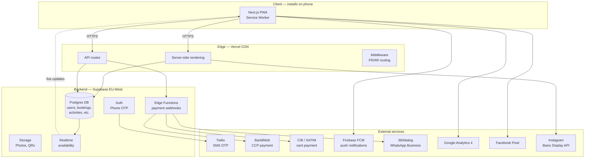

# L'Étoile de l'Est — Technical Sheet

**Project**: Progressive Web App for Complexe Touristique L'Étoile de l'Est
**Location**: Ain Abid, Constantine, Algeria
**Owner**: Faouzi Sahraoui
**Document version**: 1.0 · May 2026
**Status**: V1 foundation built · pending owner wiring of external services

---

## 0 · How to read this document

This is not a marketing brochure. It is the **operational blueprint** of the
L'Étoile de l'Est digital platform. It exists to answer three questions
honestly:

1. **What is this thing made of?** Every external service, every dependency,
   every contract that must exist for the app to function in production.
2. **What do you (the owner) need to provide?** Accounts, credentials,
   merchant agreements, content, decisions.
3. **What will it cost, and what will it not do?** Monthly running costs, what
   works only in certain conditions, what does not work at all from Algeria.

If you read only one section, read **§9 — Owner Deliverables Checklist**.

---

## 1 · Executive summary

L'Étoile de l'Est is a 25-hectare agrotourism complex that today operates with
**zero functional digital infrastructure**. Bookings happen on WhatsApp and by
phone. No customer data is captured. No loyalty mechanism exists. The
abandoned legacy website (etoiledelest-dz.com) is not in service.

This project is **Phase 2** of a 3-phase digital transformation:

| Phase | Goal | Status |
|---|---|---|
| 1 — SEO + Social Presence | Establish discoverability | Done |
| **2 — PWA (this project)** | **Digital booking + loyalty + check-in** | **In build** |
| 3 — Native mobile app | Apple/Google stores | When user base ≥ 5 000 |

The PWA is a single web application that **installs on a phone like a native
app**, works on slow Algerian 4G, handles offline gracefully, supports
BaridiMob and CIB payments, and operates in both French and Arabic
(right-to-left for Arabic).

**The non-negotiable success bar:** a 45-year-old guest from Constantine who
books everything through Facebook today must be able to complete a booking
end-to-end in under 3 minutes, without help, on their phone.

If the app does not meet that bar, it has failed regardless of how
technically impressive it is.

---

## 2 · Strategic context

### Why this project exists

The complex generates real revenue today (~2 000 visitors/week at peak
summer) with no digital tools. Every reservation is a WhatsApp message that
someone must read, respond to, manually verify, and write down. There is no
record of who came, when, how often, or what they spent. Customer loyalty is
based on memory.

The PWA exists to:

- **Convert passive followers into trackable customers.** Most current
  customers come from Facebook. Today, they arrive as anonymous WhatsApp
  messages. After launch, they arrive as identifiable accounts with booking
  history.
- **Reduce manual reservation handling.** Today's flow consumes hours of
  staff time and produces conflicting double-bookings. The PWA automates
  availability, payment confirmation, and arrival check-in.
- **Build a loyalty mechanism.** Currently nothing prevents a customer from
  forgetting the complex exists. The Étoiles Fidélité program creates a
  reason to return.
- **Capture data for future decisions.** Which packages sell? Which
  activities are most-booked? Which days fill first? Today none of this is
  measurable.

### What this PWA is NOT

It is **not** a generic booking website. It is built specifically for the
operational realities of the complex and Algerian customer behavior:

- Phone-first authentication (most users do not regularly use email)
- BaridiMob as primary payment (most users do not own a CIB card)
- WhatsApp as primary confirmation channel (most trusted by users)
- Offline-capable QR code for arrival (4G is unreliable on-site)
- French-first UI with Arabic mirror (target market is French-educated)

---

## 3 · The success bar — measurable targets

These are not aspirational. They are the metrics that determine whether the
investment was worth it.

| Metric | Target (90 days after launch) |
|---|---|
| PWA installs / returning visitors | ≥ 15% |
| Homepage → booking conversion | ≥ 3% |
| Bookings completed in-app (vs. WhatsApp/phone) | ≥ 40% by month 3 |
| Loyalty enrollment (booked customers) | ≥ 60% |
| Returning visitors within 90 days | ≥ 25% |
| App store listing — not applicable for V2; PWA installability score | ≥ 95 (Lighthouse) |
| Time to complete first booking (median) | ≤ 3 minutes |

If, by day 90, bookings have not measurably shifted from WhatsApp to digital,
the project has not succeeded. We will track these metrics from day 1.

---

## 4 · System architecture — the big picture

The app is composed of **three layers** and depends on **eleven external
services**. Each piece has a specific job.



### What lives where

| Layer | Hosted by | What it does |
|---|---|---|
| **Client** | The user's phone | Renders the UI · stores QR codes for offline access · sends booking requests |
| **Edge** | Vercel CDN (worldwide, closest server to user) | Renders pages on first load · runs API routes · routes by language |
| **Backend** | Supabase (EU-West / Ireland) | Stores all data · authenticates users · holds photos · sends payment webhooks |
| **External** | Various | SMS delivery, payment processing, push delivery, WhatsApp delivery, analytics |

---

## 5 · The eleven external services — full inventory

This is the complete list of third-party platforms the app depends on. **Each
one requires an account, credentials, and in some cases a contract.** None
can be skipped without breaking a feature.

### 5.1 Vercel — Frontend hosting

- **What it does**: Hosts and serves the Next.js application from a global
  CDN. Handles HTTPS, automatic deploys from Git, performance optimization.
- **Why this and not another**: Built by the Next.js team. Free tier is
  sufficient for V1. Vercel is the de-facto standard for Next.js apps.
- **Algerian context**: Works from Algeria. Their CDN does not have an Algiers
  node, but the European nodes deliver acceptable latency over 4G.
- **Account needed**: Yes — single account, organization-owned recommended.
- **Cost**: **Free tier** sufficient until ≥ 100 GB bandwidth/month.
  Pro tier $20/month (~3 000 DZD) unlocks better analytics and team seats.

### 5.2 Supabase — Backend (database + auth + storage + realtime)

- **What it does**: Five things in one platform:
  1. **PostgreSQL database** — all customer, booking, accommodation, activity data
  2. **Authentication** — manages user accounts, phone OTP, sessions
  3. **Storage** — hosts uploaded photos (galleries, accommodation images)
  4. **Realtime** — pushes live updates (e.g. someone just booked → calendar greys out the date)
  5. **Edge Functions** — runs server code for payment webhooks
- **Why this and not another**: Open-source. One vendor instead of five.
  Region choice (Ireland/EU-West) gives best Algeria latency among compliant
  regions. The free tier supports a real business.
- **Algerian context**: Cloud-hosted in EU. Compliant with GDPR-style data
  rules. No restriction for Algerian businesses to use it.
- **Account needed**: Yes — single project, name it `etoile-de-lest-prod`.
- **Cost**: **Free tier** = 500 MB database, 1 GB storage, 50 000 monthly
  active users. Sufficient for the first ~6 months.
  Pro tier $25/month (~3 750 DZD) when growth exceeds free limits.

### 5.3 Twilio — SMS OTP delivery (via Supabase Auth)

- **What it does**: When a user signs in with their phone number, Twilio
  sends them a 6-digit code via SMS. The user types the code; Supabase Auth
  verifies it; the user is logged in.
- **Why this and not another**: Twilio is the only SMS provider integrated
  natively with Supabase Auth and the only one with proven reliability for
  Algerian numbers (+213).
- **Algerian context**: SMS delivery to +213 works, but is slower than to EU
  numbers (10–30 seconds typical) and costs more per message. Some operators
  (Mobilis, Djezzy, Ooredoo) have different latencies.
- **Account needed**: Yes — Twilio account + a Messaging Service SID.
  Configured **inside Supabase**, not in our `.env`.
- **Cost**: **~$0.075 per SMS to Algeria** (~11 DZD).
  Estimated monthly volume: 500 OTPs (signups + logins) = **~5 600 DZD/month**.
  Twilio also charges for the phone number (~$1/month if dedicated).

### 5.4 BaridiMob / Algérie Poste — Primary payment

- **What it does**: BaridiMob is the mobile app of Algérie Poste, the
  national postal service. Algerians use it to send money via CCP (Compte
  Chèque Postal). The most-used payment method in Algeria, especially among
  users who do not have a CIB bank card.
- **How it works in our system (V1)**:
  1. User selects "BaridiMob" at checkout
  2. System displays the complex's CCP account number + a unique reference code
  3. User opens BaridiMob app, sends payment to the CCP with the reference
  4. Admin receives push notification, manually verifies the transfer
  5. Admin clicks "Mark as paid" → booking is confirmed, WhatsApp confirmation sent
- **Why manual confirmation**: BaridiMob does not yet offer a public webhook
  API for merchants. Real-time confirmation is not technically possible in
  V1. This will change in V2 once Algérie Poste opens their API.
- **Algerian context**: Essential. Most family customers will use this.
- **Account needed**: The complex must already have an **Algérie Poste CCP
  account**. Owner must provide CCP number + RIB.
- **Cost**: BaridiMob charges minimal transfer fees, typically absorbed by
  the sender. The complex pays nothing per transaction.

### 5.5 CIB / SATIM / GIE Monétique — Card payment

- **What it does**: Online card payment for holders of Algerian CIB
  interbank cards. Operated by SATIM (Société d'Automatisation des
  Transactions Interbancaires).
- **How it works**: User selects "Carte CIB" → redirected to SATIM gateway →
  enters card details on SATIM's site → SATIM sends webhook to our server →
  booking confirmed.
- **Why this and not Stripe/PayPal**: **Stripe and PayPal do not work for
  Algerian merchants.** They cannot accept Algerian bank accounts as the
  payout destination. CIB/SATIM is the only option for online card payment in
  Algeria.
- **Algerian context**: Adoption is growing but still minority. ~20% of
  customers will use this.
- **Account needed**: Yes — a **merchant agreement** through the complex's
  bank. This is a paperwork process taking **2–6 weeks** typically. The
  complex's bank must support SATIM e-payment.
- **Cost**: SATIM typically charges **1–3% per transaction** + a fixed
  monthly fee (~3 000 DZD). Setup fee from the bank may apply.
- **Critical**: This is the **longest dependency**. Start the bank
  application immediately if CIB payment is required for launch.

### 5.6 Firebase Cloud Messaging (FCM) — Push notifications

- **What it does**: Sends push notifications to the user's phone even when
  the PWA is closed. Used for booking confirmations, check-in reminders,
  seasonal offers, loyalty milestones.
- **Why this and not another**: FCM is free, well-supported by browsers, and
  works for both Android (excellent support) and iOS 16.4+ (limited support).
- **Algerian context**: Works. iOS users on older versions (< 16.4) will not
  receive push; they will fall back to WhatsApp confirmation.
- **Account needed**: Yes — a Firebase project (Google account). Configure as
  "Web app". Get the VAPID key for push subscription.
- **Cost**: **Free** with virtually no limit for the volume we expect.

### 5.7 360dialog — WhatsApp Business API

- **What it does**: Sends template messages over WhatsApp Business. Used to
  send booking confirmations, reminders, payment confirmations.
- **Why this and not direct WhatsApp**: WhatsApp does not offer free API
  access. Meta requires a Business Solution Provider (BSP). 360dialog is the
  cheapest and most reliable BSP that supports +213 numbers without long
  approval delays.
- **Algerian context**: This is **the most-trusted communication channel** for
  Algerian customers. A WhatsApp confirmation feels more legitimate than an
  SMS or email. Skipping this is not a good idea.
- **Account needed**: Yes — 360dialog account + Facebook Business Manager +
  approved WhatsApp Business number. Templates must be pre-approved by Meta
  (takes 1–3 days per template).
- **Templates to prepare and submit for approval** (FR + AR):
  1. `booking_confirm` — "Votre réservation [ref] est confirmée pour le [date]"
  2. `payment_reminder` — "Paiement de [montant] en attente — référence [ref]"
  3. `checkin_ready` — "Votre QR d'accueil est prêt — présentez-le à l'arrivée"
  4. `arrival_today` — "Bienvenue ! Nous vous attendons aujourd'hui"
- **Cost**: 360dialog charges $5/month base + per-conversation fee
  (~$0.05/conversation in Algeria). Estimated **~$30–50/month** at our scale =
  **~4 500–7 500 DZD/month**.

### 5.8 Google — Fonts & Analytics 4

- **What it does**:
  - **Google Fonts**: Cairo (Arabic), Cormorant Garamond, Inter, DM Mono.
    Loaded over CDN, free.
  - **Google Analytics 4**: Tracks page views, conversion funnel, drop-off
    points in the booking flow.
- **Account needed**: Google account (already used for Firebase). Create a GA4
  property for `etoiledelest-dz.com`.
- **Cost**: **Free** for both.

### 5.9 Facebook (Meta Business) — Pixel + Open Graph

- **What it does**: The Facebook Pixel tracks user actions on the site
  (viewed page, started booking, completed booking) so that:
  - Future Facebook/Instagram ads can target relevant audiences
  - The complex can see conversion rates from social ads
  - Link previews on Facebook show beautiful Open Graph cards
- **Why this matters specifically here**: Facebook is the **primary social
  presence of the complex**. Most current customers come via Facebook.
  Skipping the Pixel means losing the ability to optimize the only existing
  marketing channel.
- **Account needed**: Facebook Business Manager + Pixel ID. Owner likely
  already has a Page for the complex.
- **Cost**: **Free**.

### 5.10 Instagram Basic Display API — Feed embed (optional)

- **What it does**: Pulls the latest 9 Instagram posts from
  @etoiledelest.dz and displays them on the gallery page.
- **Why optional**: Nice-to-have, not essential. The complex's main social
  presence is Facebook, not Instagram.
- **Account needed**: Facebook Developer app + Instagram Basic Display
  configuration. ~30 min setup.
- **Cost**: **Free**.

### 5.11 Domain registrar — `etoiledelest-dz.com`

- **What it does**: Holds the domain name pointing to the Vercel app.
- **Current status**: The owner already owns `etoiledelest-dz.com` from the
  abandoned legacy site. Decision needed: **reuse it, or buy a new one?**
- **Recommendation**: Reuse it. SEO equity (if any) and brand consistency
  outweigh the cost of a new domain. Update DNS to point at Vercel.
- **Cost**: ~$15/year (~250 DZD/month).

---

## 6 · The data flow — what actually happens when a guest books

This is the most important section for understanding why all these pieces
need to be wired correctly. **Every step depends on a different service.**

### 6.1 First-time booking flow

```
┌──────────────────────────────────────────────────────────────────┐
│ Step 1 — Guest discovers complex via Facebook ad                 │
│ Service used: Facebook Pixel (tracks click)                      │
└──────────────────────────────────────────────────────────────────┘
                              │
                              ▼
┌──────────────────────────────────────────────────────────────────┐
│ Step 2 — Lands on homepage (etoiledelest-dz.com)                 │
│ Services: Vercel (CDN), Google Fonts, GA4                        │
│ Behavior: middleware detects French → redirects to /fr           │
└──────────────────────────────────────────────────────────────────┘
                              │
                              ▼
┌──────────────────────────────────────────────────────────────────┐
│ Step 3 — Clicks "Réserver", lands in booking wizard              │
│ Service: Vercel SSR                                              │
└──────────────────────────────────────────────────────────────────┘
                              │
                              ▼
┌──────────────────────────────────────────────────────────────────┐
│ Step 4 — Step 2 of wizard: selects dates                         │
│ Service: Supabase Realtime — unavailable dates greyed in real-   │
│ time (if someone else just booked that night)                    │
└──────────────────────────────────────────────────────────────────┘
                              │
                              ▼
┌──────────────────────────────────────────────────────────────────┐
│ Step 5 — Step 4 of wizard: enters phone number                   │
│ Service: Supabase Auth → Twilio SMS                              │
│ User receives 6-digit OTP via SMS, types it in                   │
└──────────────────────────────────────────────────────────────────┘
                              │
                              ▼
┌──────────────────────────────────────────────────────────────────┐
│ Step 6 — Step 5: chooses BaridiMob payment                       │
│ Service: shows CCP details + reference code (no API call yet)    │
└──────────────────────────────────────────────────────────────────┘
                              │
                              ▼
┌──────────────────────────────────────────────────────────────────┐
│ Step 7 — Step 6: confirmation page                               │
│ Services: Supabase (row inserted with status=pending),           │
│           qrcode library (generates QR on client),               │
│           360dialog (sends WhatsApp confirmation)                │
│ Result: user sees QR + reference, receives WhatsApp              │
└──────────────────────────────────────────────────────────────────┘
                              │
                              ▼
┌──────────────────────────────────────────────────────────────────┐
│ Step 8 — User opens BaridiMob app, sends payment                 │
│ NO INTEGRATION — happens entirely in BaridiMob                   │
└──────────────────────────────────────────────────────────────────┘
                              │
                              ▼
┌──────────────────────────────────────────────────────────────────┐
│ Step 9 — Admin sees pending payment in admin dashboard           │
│ Services: Supabase (query), FCM (alert push to admin's phone)    │
│ Admin verifies in their BaridiMob app, marks booking as paid     │
└──────────────────────────────────────────────────────────────────┘
                              │
                              ▼
┌──────────────────────────────────────────────────────────────────┐
│ Step 10 — Booking confirmed → user notified                      │
│ Services: Supabase Edge Function triggers →                      │
│           360dialog (WhatsApp confirm) + FCM (push)              │
└──────────────────────────────────────────────────────────────────┘
                              │
                              ▼
┌──────────────────────────────────────────────────────────────────┐
│ Step 11 — Day before arrival                                     │
│ Service: Supabase scheduled function → FCM + 360dialog           │
│ Sends reminder + check-in tips                                   │
└──────────────────────────────────────────────────────────────────┘
                              │
                              ▼
┌──────────────────────────────────────────────────────────────────┐
│ Step 12 — Arrival day: guest opens app, shows QR                 │
│ Service: PWA Service Worker (works OFFLINE — critical)           │
│ The QR is generated client-side from cached data                 │
└──────────────────────────────────────────────────────────────────┘
                              │
                              ▼
┌──────────────────────────────────────────────────────────────────┐
│ Step 13 — Staff scans QR with admin tablet                       │
│ Services: @zxing/browser (camera), Supabase (mark completed)     │
│ Booking status → "completed", loyalty points awarded             │
└──────────────────────────────────────────────────────────────────┘
                              │
                              ▼
┌──────────────────────────────────────────────────────────────────┐
│ Step 14 — Post-stay                                              │
│ Service: 360dialog → WhatsApp asks for review + shows points     │
└──────────────────────────────────────────────────────────────────┘
```

If **any** of these external services is misconfigured, the corresponding
step fails. Twilio not wired → no one can log in. 360dialog not wired → no
WhatsApp confirmations → users will not trust the booking. BaridiMob CCP
wrong → payments go to nowhere.

### 6.2 The CIB card payment flow (faster, more automated)

When wired, CIB payment becomes:

```
Step 7 alternative — User chooses "Carte CIB"
   → Redirect to SATIM gateway (leaves our site)
   → Enters card details on SATIM
   → SATIM verifies, redirects back to our /api/webhooks/payment
   → Webhook updates booking.payment_status = paid IMMEDIATELY
   → WhatsApp confirmation sent
```

No manual step. ~3 minutes total. This is why CIB is worth the paperwork.

---

## 7 · Critical Algerian-specific constraints

These are not preferences — they are facts of operating in Algeria that
shape the architecture.

| Constraint | Implication |
|---|---|
| **Stripe and PayPal do not accept Algerian bank accounts** | We must use BaridiMob + CIB. There is no Stripe-quality alternative. |
| **BaridiMob has no public real-time API** | Payment confirmation is manual in V1. Admin must verify each transfer. We built the workflow for this. |
| **CIB merchant agreement takes 2–6 weeks** | Start the bank paperwork **first**, before any other technical work. |
| **+213 SMS is slower and more expensive** | OTP delivery may take 10–30 seconds. Build patience into UX (don't show "OTP failed" until 60s). |
| **iOS push notifications limited pre-16.4** | Many older iPhones in Algeria. We fall back to WhatsApp + SMS. |
| **Algerian 4G is inconsistent on-site** | Service worker must aggressively cache. QR check-in must work fully offline. |
| **Many users don't have Google/Apple accounts** | Phone OTP is mandatory primary auth. No Google OAuth. |
| **Facebook >>> Instagram for local audience** | Facebook Pixel + Open Graph cards are more important than Instagram embed. |
| **Arabic must be Eastern Arabic-Indic numerals** | `Intl.NumberFormat('ar-DZ')` handles this — already implemented. |
| **Algerian phone format** | +213 prefix, 9 digits after. Validation regex handles 05/06/07 prefixes. |
| **Cash is still common** | "Payer sur place" option exists for trusted return customers (admin-configurable). |
| **Devices may have ≤ 4 GB RAM** | Bundle size discipline matters. We use code-splitting and dynamic imports. |

---

## 8 · The data — what we store and why

The PostgreSQL database (in Supabase) contains 9 tables. Owner can request a
data export at any time. All data lives in the EU-West region (Ireland).

| Table | What it stores | Why |
|---|---|---|
| `users` | Phone, name, email, language, loyalty points | Identity + personalization |
| `accommodations` | Chalets, tents, glamping — names, prices, photos, amenities | Catalog |
| `activities` | Riding, quad, pool, beekeeping, etc. — descriptions, prices | Catalog |
| `packages` | Bundle deals (e.g. weekend + activities discount) | Promotions |
| `bookings` | All reservations — dates, guests, total, status, payment | Operational core |
| `loyalty_transactions` | Points earned / redeemed per booking | Loyalty integrity |
| `reviews` | Guest reviews (admin-moderated before publishing) | Social proof |
| `notifications_log` | Every push, WhatsApp, SMS we sent | Audit + debugging |
| `fcm_tokens` | Push subscription tokens per device | Push delivery |

**Row-Level Security (RLS)** is enforced at the database level:
- Users can only read/write their own rows
- Public can only read published reviews and active accommodations/activities
- Only `role = admin` users can manage bookings, content, notifications

This is enforced by Postgres itself, not by application code — so even if
the app has a bug, the database refuses to leak data across users.

---

## 9 · Owner deliverables checklist

**This is the section you (Faouzi) need to act on.** Every item below
requires owner action. None can be done by the developer alone.

### 9.1 Accounts and contracts to set up

| # | Item | Where | Time | Cost | Priority |
|---|---|---|---|---|---|
| 1 | **Domain DNS access** | Existing registrar of `etoiledelest-dz.com` | 1 day | $15/yr | P0 |
| 2 | **Supabase account + project** | supabase.com | 30 min | Free initially | P0 |
| 3 | **Vercel account** | vercel.com | 15 min | Free initially | P0 |
| 4 | **Twilio account + Algerian SMS enabled** | twilio.com | 1 hour | ~$5 setup | P0 |
| 5 | **CCP account confirmation** (already exists) | Already with Algérie Poste | — | Existing | P0 |
| 6 | **CIB merchant agreement** with your bank | Your bank branch | **2–6 weeks** | Setup + 1–3%/tx | P1 |
| 7 | **Firebase project** | firebase.google.com | 30 min | Free | P1 |
| 8 | **360dialog WhatsApp Business** | 360dialog.com | 2–5 days (Meta approval) | ~$30/mo | P1 |
| 9 | **Facebook Business Manager + Pixel** | business.facebook.com | 30 min | Free | P2 |
| 10 | **Google Analytics 4 property** | analytics.google.com | 15 min | Free | P2 |
| 11 | **Instagram Basic Display app** (optional) | developers.facebook.com | 30 min | Free | P3 |

P0 = blocking launch. P1 = required for production. P2 = required for
optimization. P3 = optional.

### 9.2 Content to provide

| # | Item | Who delivers | Format | When needed |
|---|---|---|---|---|
| 1 | **Logo files** (SVG + PNG) — brand identity | Owner / designer | SVG preferred | Before icon redesign |
| 2 | **Professional photography** — chalets (each room), activities (riding, pool, quad, etc.), restaurant (dishes), grounds, seasons | Photographer | High-res WebP/JPG | Before launch |
| 3 | **Restaurant menu** — full list with current prices in FR + AR | Restaurant manager | Spreadsheet | Before launch |
| 4 | **Accommodation descriptions** — accurate descriptions in FR for each unit | Owner | Word doc | Before launch |
| 5 | **Activity descriptions + scheduling** — when each activity runs, capacity, current prices | Activity manager | Spreadsheet | Before launch |
| 6 | **Arabic content review** — native speaker reviews all AR translations | Trusted bilingual reviewer | Annotations on existing JSON | Before launch |
| 7 | **Legal pages** — Mentions légales, Confidentialité (templates exist online) | Owner / lawyer | Text | Before public launch |
| 8 | **Brand color overrides** (optional — current palette already designed) | Owner | Hex codes | Before launch if changing |

### 9.3 Operational decisions

These are questions only the owner can answer.

1. **Final loyalty thresholds** — Current proposal: 1 pt / 100 DA spent;
   500 pts = 500 DA off; 2000 pts = free activity; 5000 pts = free weeknight.
   Confirm or adjust.
2. **Tier names** — Currently Bronze/Argent/Or. OK or rename?
3. **Cancellation policy** — How many hours before check-in can a guest
   cancel? Refund policy? Currently not implemented; needs owner answer.
4. **Deposit percentage** — Currently 30% deposit, 70% on arrival. Confirm.
5. **Holiday calendar** — Which dates are "jours fériés" (priced at holiday
   rate)? Current default uses 2026 Algerian public holidays. Add complex
   events (e.g. Aïd-week pricing)?
6. **Admin phone numbers** — Which phone numbers receive admin role on first
   login? List 2–4 trusted staff.
7. **Bank account for revenue** — Where does CIB payment settle? The CCP
   already covers BaridiMob.
8. **Refund handling** — Who has authority to refund? Owner only? Manager?
9. **Review moderation policy** — Auto-publish 4–5 star reviews? Always
   require manual approval? Currently always manual.
10. **Data retention** — How long do we keep booking history? Loyalty
    history? GDPR-equivalent obligations under Algerian Law 18-07.

---

## 10 · Cost estimation — monthly running

This is what the complex will pay every month after launch, assuming
realistic V1 volume (~200 bookings/month, ~500 SMS OTPs/month).

| Service | Tier | Monthly cost (USD) | Monthly cost (DZD est.) |
|---|---|---|---|
| Vercel | Free → Pro (later) | $0 → $20 | 0 → 3 000 |
| Supabase | Free → Pro (later) | $0 → $25 | 0 → 3 750 |
| Twilio SMS (+213) | Pay-per-use | ~$40 | ~6 000 |
| 360dialog WhatsApp | Base + per-conversation | ~$40 | ~6 000 |
| Firebase FCM | Free | $0 | 0 |
| Google Analytics 4 | Free | $0 | 0 |
| Facebook Pixel | Free | $0 | 0 |
| Domain | Annual / 12 | $1.25 | ~190 |
| CIB transaction fees | 1.5% of CIB volume | varies | varies |
| **Subtotal — fixed infrastructure** | | **~$80** | **~12 000** |
| **CIB merchant monthly fee** (when active) | Bank-dependent | ~$25 | ~3 750 |
| **TOTAL with CIB** | | **~$105** | **~15 750** |

**At scale** (1 000+ bookings/month, after Year 1):
- Add Vercel Pro: +$20 → ~3 000 DZD
- Add Supabase Pro: +$25 → ~3 750 DZD
- More Twilio + 360dialog: +$80 → ~12 000 DZD
- **Total at scale: ~$230/mo ≈ ~34 000 DZD/mo**

**Plus per-transaction fees from CIB** (1.5% of CIB revenue). BaridiMob has no
per-transaction merchant fee for the receiver.

These costs are **infrastructure only** — they exclude staff time, content
creation, paid advertising, and future feature development.

---

## 11 · Phasing — what unlocks what

Some pieces can be done in parallel; others must wait. Here is the
realistic dependency order:

### Phase A — Foundation (Done · this commit)
- ✅ Codebase: Next.js 14 PWA, bilingual FR/AR, all routes, design system
- ✅ Database schema as SQL migrations (ready to apply)
- ✅ Mock-mode for dev work without backend
- ✅ Documentation (this file)

### Phase B — Owner setup (Weeks 1–2, parallel)
- [ ] Owner creates: Vercel, Supabase, Twilio, Firebase, Facebook Business accounts
- [ ] Owner initiates: CIB bank application (start of long fuse)
- [ ] Owner initiates: 360dialog WhatsApp Business signup
- [ ] Owner provides: domain DNS access, CCP details, admin phones

### Phase C — Backend wiring (Week 2)
- [ ] Apply Supabase migrations
- [ ] Configure Supabase Auth → Twilio for OTP
- [ ] Set environment variables in Vercel
- [ ] Deploy to staging environment
- [ ] Owner tests end-to-end booking with BaridiMob manual flow

### Phase D — Communications wiring (Weeks 3–4)
- [ ] 360dialog templates submitted + Meta-approved
- [ ] WhatsApp confirmation Edge Function deployed
- [ ] FCM push subscription flow wired
- [ ] Push notification triggers connected to booking lifecycle

### Phase E — Content + polish (Weeks 4–5)
- [ ] Real photography uploaded to Supabase Storage
- [ ] Arabic content reviewed by native speaker
- [ ] Restaurant menu finalized in admin CMS
- [ ] Legal pages added
- [ ] Real PWA icons (replace placeholders) based on logo
- [ ] Analytics events firing (GA4 + Facebook Pixel verified)

### Phase F — Soft launch (Week 6)
- [ ] Invite-only beta with 20 trusted past customers
- [ ] Monitor: signup completion rate, booking completion rate, error rate
- [ ] Fix issues
- [ ] Owner trains 2 staff members on admin dashboard

### Phase G — Public launch (Week 7)
- [ ] Facebook announcement post with deep link to PWA
- [ ] DNS cut over from old site to Vercel
- [ ] Monitor real-time analytics
- [ ] Daily standup with owner for first 2 weeks

### Phase H — CIB activation (when bank approves, anytime after Phase F)
- [ ] CIB merchant credentials added to environment
- [ ] CIB option enabled in payment step
- [ ] Test with real card before announcing

### Phase I — V2 features (Months 2–6)
- [ ] Restaurant in-complex ordering via table QR codes
- [ ] Wedding/corporate event booking with quote system
- [ ] Referral program
- [ ] Advanced admin analytics (cohort retention, LTV)
- [ ] UGC photo gallery (guest uploads after stay)
- [ ] Blog content engine for SEO

### Phase J — V3 — Native apps (Month 6+, conditional)
- Reassess when monthly active users ≥ 5 000
- Decision point: build native iOS/Android, or stay PWA?

---

## 12 · Operational risks and mitigations

| Risk | Likelihood | Impact | Mitigation |
|---|---|---|---|
| **Twilio SMS not delivered** to specific carrier | Medium | Login broken | Fallback to email OTP for users with verified email; manual reset by admin |
| **BaridiMob transfer goes to wrong CCP** | Low | Lost money | Reference code on every payment ties transfer to booking; admin reconciles weekly |
| **CIB bank takes > 6 weeks** | High | CIB unavailable at launch | Launch with BaridiMob-only; add CIB later. Communicate to users. |
| **360dialog template rejection by Meta** | Medium | No WhatsApp confirmation | Resubmit with revised wording; fall back to SMS via Twilio |
| **Supabase free tier exhausted unexpectedly** | Low | Service degraded | Monitor weekly; upgrade to Pro proactively at 80% usage |
| **iOS user can't install PWA** | Medium for iOS < 16.4 | Lower adoption on iPhone | "Install" button hidden for incompatible iOS; show "Use Safari" guide |
| **4G outage on-site (arrival day)** | Medium | Can't show QR code | Service worker caches QR ahead of time; offline page shows it |
| **Loyalty point gaming** (fake bookings to earn points) | Low | Loyalty inflation | Points awarded only when booking status = completed (post-checkin scan) |
| **Double-booking same night** | Low | Customer dissatisfaction | Realtime availability lock during checkout; DB constraint on overlap |
| **Owner can't access admin if password lost** | Medium | Lock-out | Admin phone allowlist; Supabase admin recovery via service role key |

---

## 13 · Roles and responsibilities

| Role | Person | Responsibilities |
|---|---|---|
| **Owner / Decision-maker** | Faouzi Sahraoui | Strategy, budget approval, all P0 account setups (§9.1), content delivery, final pricing decisions, cancellation policy |
| **Reception / Admin staff** | 2 trained staff | Daily booking verification, BaridiMob payment confirmation in admin dashboard, QR scanning at arrival, content updates (menu, prices) |
| **Restaurant manager** | TBD | Menu updates in admin CMS |
| **Activity manager** | TBD | Activity schedule + capacity in admin CMS |
| **Developer (current)** | This delivery | Code, integration wiring, deployment, technical training of staff, bug fixes |
| **Designer (future)** | TBD | Final brand assets — logo SVG, real PWA icons, photo treatment guidelines |
| **Photographer (future)** | TBD | Professional photo set (~80 photos covering all zones, all seasons) |
| **Arabic reviewer (future)** | Trusted bilingual contact | Review and correct AR translations in JSON files |
| **Legal advisor (one-off)** | Owner's existing counsel | Confirm GDPR-equivalent compliance under Algerian Law 18-07; sign off on Privacy Policy text |

---

## 14 · Security and data protection

- **Data residency**: All data in EU-West (Ireland). Supabase is compliant
  with GDPR-equivalent standards. Algerian Law 18-07 on personal data
  protection should be reviewed by counsel for any specific local
  obligations.
- **Authentication**: Phone OTP (no passwords stored). Session tokens
  signed by Supabase, HttpOnly cookies.
- **Row-Level Security**: Enforced at database level — users physically
  cannot access other users' data even if the app has a bug.
- **HTTPS everywhere**: Enforced by Vercel.
- **Payment data**: We never store card numbers. SATIM holds them; we only
  receive webhooks confirming success.
- **Service role key**: The Supabase admin key bypasses RLS — must be
  treated as the master key. Stored only in Vercel environment variables,
  never in code, never logged.
- **Webhook signatures**: BaridiMob and SATIM webhooks must be verified
  via HMAC signatures (secret stored in environment) before being trusted.
  Code stub exists in `app/api/webhooks/payment/route.ts`.
- **Admin allowlist**: Only phone numbers in the `ADMIN_PHONE_ALLOWLIST`
  environment variable get admin role on first sign-in.

---

## 15 · What this PWA does not do (intentional limits)

To be honest about scope:

- **Does not handle restaurant POS** — table ordering is a V2 feature, but
  full point-of-sale (cashier, kitchen tickets, receipt printing) is out of
  scope for this entire roadmap. Use existing POS.
- **Does not handle accounting** — booking data can be exported, but
  invoicing, expense tracking, payroll are out of scope.
- **Does not handle staff scheduling** — no shift planning, no time clock.
- **Does not handle inventory** — no tracking of bedding, towels, kitchen
  stock.
- **Does not replace WhatsApp entirely** — some customers will always
  prefer to call or message directly. The PWA augments, doesn't eliminate.
- **No iOS native app** — that is Phase 3, conditional on user volume.
- **No multi-property support** — single complex. If the complex expands
  later, adding properties requires schema changes.

---

## 16 · Glossary

| Term | Meaning |
|---|---|
| **PWA** | Progressive Web App — installable from browser, works offline, no app store |
| **Service Worker** | Background script that caches content for offline use |
| **CCP** | Compte Chèque Postal — Algerian postal banking account |
| **BaridiMob** | Mobile app of Algérie Poste for sending CCP transfers |
| **CIB** | Carte Interbancaire — Algerian bank card (Visa-equivalent for domestic use) |
| **SATIM / GIE Monétique** | The clearinghouse operating CIB online payments |
| **FCM** | Firebase Cloud Messaging — Google's push notification service |
| **RLS** | Row-Level Security — Postgres feature that filters rows by user |
| **OTP** | One-Time Password — 6-digit code sent by SMS |
| **SSR** | Server-Side Rendering — page is built on the server, sent fully formed |
| **CDN** | Content Delivery Network — cached copies of the site close to the user |
| **VAPID** | Voluntary Application Server Identification — key for web push auth |
| **Open Graph** | Meta tags that control how a link previews on Facebook/WhatsApp |
| **i18n / RTL** | Internationalization / Right-To-Left (Arabic) |
| **WebP / AVIF** | Modern image formats that compress better than JPG |
| **Edge Function** | Code that runs at the CDN edge (not on origin server) for low latency |

---

## 17 · Final note to the owner

This is not just a website. It is the **operational nervous system** of the
complex's customer-facing operations. When wired correctly, it does six
jobs simultaneously:

1. **A storefront** — discoverable, beautiful, bilingual
2. **A reservation system** — with real availability and real payment
3. **A CRM** — every customer is identified and trackable
4. **A loyalty engine** — gives customers a reason to return
5. **A check-in tool** — QR-based arrival, even offline
6. **A communication channel** — push + WhatsApp + SMS

Each of these jobs depends on services hosted by different companies, in
different countries, with different costs and different SLAs.

The fragility is real: if Twilio has an outage, logins break. If
360dialog rejects a template, confirmations don't go out. If the CIB bank
takes 8 weeks instead of 4, card payment is delayed.

The robustness is also real: every service has a fallback (SMS → WhatsApp
→ manual call), data is replicated, and the offline-first design means
the most critical feature (showing a QR at arrival) cannot fail even on
zero connectivity.

The work that remains is **mostly operational, not technical**: opening
accounts, signing the CIB agreement, providing real photos, training
staff. The code is in place.

What you choose to invest in this digital infrastructure today determines
how the complex grows over the next five years. There is no halfway: a
half-wired version is worse than no version at all.

This document is the map. The path forward is in §9.

---

*Document maintained in `/docs/TECHNICAL_SHEET.md`. Update with every
material architecture change.*
