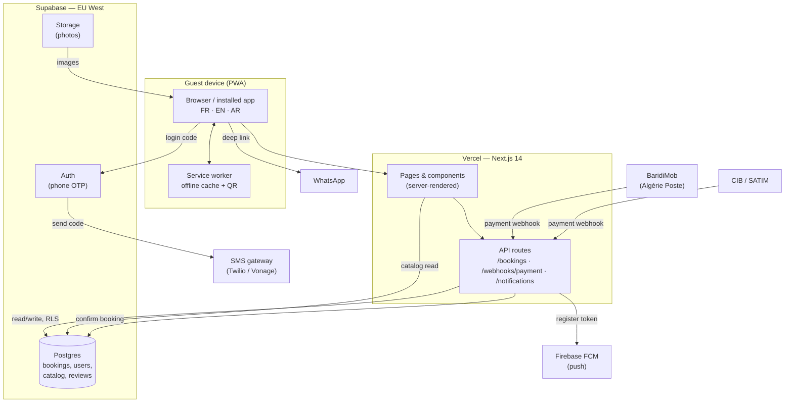

# Oxygen Island DZ — Technical Sheet

**Audience:** the venue owner / operator.
**Purpose:** what the platform is, the outside services it depends on, what each
costs in Algerian dinars, and the concrete steps only you (the owner) can do —
opening accounts and confirming numbers.

> This is a plain-language companion to the developer docs. It avoids code and
> focuses on decisions, accounts, and money.

---

## 1. What the platform is

Oxygen Island DZ is a **Progressive Web App (PWA)** — a website that behaves like
a phone app. Guests open it in a browser, and can "Add to Home Screen" to get an
app icon, offline access, and full-screen mode, with **no App Store / Play Store
submission, review, or fees**.

It does four things:

1. **Showcase** the club — a cinematic homepage plus a catalog of passes,
   cabanas, and events, in **French, English, and Arabic** (right-to-left).
2. **Take bookings** online — the guest chooses a pass/cabana/event, a date, and
   party size, and pays with an Algerian payment method.
3. **Check guests in** — every booking generates a **QR code** the guest shows at
   the gate. Staff scan it from the admin area. It works even with no signal.
4. **Manage operations** — staff see the day's reservations, an agenda, and a
   gate scanner; guests see their own bookings and QR.

### Today vs. live

The app is built to run in **"mock mode" from day one**: it works end-to-end
using built-in demo data, with **no accounts and no monthly cost**, so you can
review it and show it to partners immediately. Switching on real bookings,
payments, and logins is a configuration step (below) — the code is already there.

---

## 2. External services

| Service | Role | Needed for launch? |
| --- | --- | --- |
| **Vercel** | Hosts the website (fast, global, automatic HTTPS). | Yes |
| **Supabase** | Database + guest accounts + photo storage (hosted in the EU). | Yes, for real bookings |
| **SMS gateway** (Twilio / Vonage / MessageBird) | Sends the login code to a guest's phone. | Yes, if guests log in by phone |
| **BaridiMob** (Algérie Poste) | Mobile / CCP payment — the most common Algerian method. | For online payment |
| **CIB / SATIM** | Bank-card payment (Algerian interbank card). | For online card payment |
| **WhatsApp** | Reservation & info line (deep-link today; Business API later). | Already working via links |
| **Firebase (FCM)** | Free push notifications to guests' devices. | Optional, later |
| **Domain name** | Your address, e.g. `oxygenisland.dz`. | Yes |

Everything guest-data-related lives in **Supabase's EU (West) region** — closest
low-latency option to Algeria and keeps data inside the EU.

---

## 3. Cost estimate (DZD)

Estimates for a seasonal beach club. **Ranges, not quotes.** Rate assumed:
**1 USD ≈ 135 DZD** (adjust to the day's rate). Foreign services (Vercel,
Supabase, SMS) bill in USD/EUR and need an international card or a paid
intermediary.

### Fixed / recurring

| Item | Plan | Monthly (DZD) | Annual (DZD) | Notes |
| --- | --- | --- | --- | --- |
| Vercel | Hobby (free) | 0 | 0 | Fine to launch; **Pro** ≈ 2 700/mo if you need team seats / analytics. |
| Supabase | Free | 0 | 0 | Free tier covers a small club. **Pro** ≈ 3 400/mo when traffic grows (daily backups, more storage). |
| Domain `.dz` | via NIC.dz | — | ~2 000–4 000 | Registered through an accredited Algerian registrar. A `.com` ≈ 1 600/yr. |
| Firebase (FCM) | Free | 0 | 0 | Push notifications are free at this scale. |
| **Subtotal (free-tier launch)** | | **~0** | **~2 000–4 000** | Essentially just the domain. |
| **Subtotal (paid tiers)** | | **~6 100** | **~73 000** | Vercel Pro + Supabase Pro + domain. |

### Per-use

| Item | Unit cost | Example volume | Est. cost (DZD) |
| --- | --- | --- | --- |
| SMS login codes | ~7–14 DZD / SMS | 1 000 logins / month | ~7 000–14 000 / month (peak season) |
| BaridiMob | Algérie Poste merchant fee (confirm with your agency) | per transaction | small % — confirm rate |
| CIB / SATIM | Interbank card fee | per transaction | small % — confirm rate |
| WhatsApp Business API (if adopted) | service conversations often free tier; then per-conversation | notifications | low — depends on volume |

### Bottom line

- **Launch (mock/demo or WhatsApp-only bookings):** effectively **the domain
  only** (~2 000–4 000 DZD/year).
- **Full online payments + phone login, peak season:** budget on the order of
  **~10 000–25 000 DZD / month** during the operating months, dominated by SMS
  and any paid Vercel/Supabase tiers, plus payment-processing percentages.
- **Off-season:** costs fall back toward the free-tier baseline.

---

## 4. Owner-action checklist

Things **only you** can do — they need your identity, your bank, or your
business registration.

### A. Accounts to open

- [ ] **Domain** — register `oxygenisland.dz` (and/or `.com`) through an
      accredited registrar. Decide the exact spelling now; it appears everywhere.
- [ ] **Vercel** — create an account (or have the developer create one under your
      email) and connect the code repository. Add the domain.
- [ ] **Supabase** — create a project in **EU (West)**. Save the database
      password. Provide the three keys to the developer (Project URL, anon key,
      service-role key).
- [ ] **SMS gateway** (if phone login) — open a Twilio (or Vonage / MessageBird)
      account, add billing, and **verify that codes actually arrive** on Mobilis,
      Djezzy, and Ooredoo numbers before launch. Delivery to `+213` is the single
      biggest thing to test.
- [ ] **BaridiMob (Algérie Poste)** — apply for merchant acceptance; obtain your
      CCP / RIB and the webhook secret. Ask for their callback/notification spec.
- [ ] **CIB / SATIM** — apply for online card acceptance via your bank; obtain the
      merchant ID, API key, gateway URL, and webhook secret.
- [ ] **Firebase** (optional, later) — create a project for push notifications.

### B. Numbers & details to confirm

- [ ] **WhatsApp numbers.** The site currently uses these public numbers —
      **confirm which is which**, and whether a third exists:
  - `+213 660 05 65 83`  → currently set as the **reservations** line
  - `+213 560 34 34 22`  → currently set as the **general info** line
  - (a third number, `+213 560 71 09 27`, appears on some listings — confirm)
- [ ] **Opening hours & pricing.** The demo uses real public figures — Adult Pass
      **8 500 DA**, Child Pass **5 000 DA**, Sunset Pass **6 000 DA**; cabanas
      **25 000 / 32 000 / 30 000 DA**; hours **10:00–19:30**. Confirm these are
      current before going live.
- [ ] **Admin phone(s).** Give the developer the phone number(s) that should have
      staff/admin access (added to the admin allow-list and marked `admin`).
- [ ] **Photos.** Provide real photography for passes, cabanas, events, and the
      homepage to replace the placeholder art.
- [ ] **Legal.** Business name, address, and any terms / privacy text to show in
      the footer.

### C. Once accounts exist (developer does this, you supply the keys)

- [ ] Put the Supabase + payment keys into the hosting environment.
- [ ] Apply the database migrations (`supabase/README.md`).
- [ ] Mark your phone as `admin` and sign in to verify the admin area.
- [ ] Run a **test booking end-to-end**, including a real (small) payment.

---

## 5. Architecture

**How a booking flows:**

1. Guest browses the catalog (served fast from the database or, in mock mode,
   from built-in data).
2. Guest logs in with their phone — Supabase sends a code via the SMS gateway.
3. Guest picks a product/date/party size and pays with BaridiMob or CIB.
4. The payment provider calls back to `/api/webhooks/payment`; the booking is
   marked **paid / confirmed** using a secure server-only key.
5. The booking's **QR code** is available in the guest's account and works
   offline; staff scan it at the gate.

---

## 6. Rendering & deployment strategy

- **Framework:** Next.js 14 (App Router). Pages are **server-rendered** for fast
  first paint and good SEO in all three languages, with interactive parts
  hydrated on the device.
- **PWA / offline:** a service worker caches pages, images, and the guest's QR.
  If the network drops, the app shows an **offline page** and the guest can still
  display their check-in QR — important at a beach where signal is uneven.
- **Internationalization:** the language is part of the address
  (`/fr`, `/en`, `/ar`); Arabic renders right-to-left. Each language is
  crawlable and shareable.
- **Hosting:** deployed on **Vercel**. Every push to the main branch builds and
  ships automatically; preview links are generated for review before release.
  HTTPS and a global edge network are included.
- **Data & security:** the database uses **Row Level Security** — a guest can
  only ever see their own bookings; staff see all. The powerful `service_role`
  key stays on the server and is never sent to browsers. Payment callbacks are
  verified with a signature before any booking is confirmed.
- **Regions:** app served globally by Vercel's edge; the database sits in
  **Supabase EU (West)** for the lowest practical latency to Algeria while
  keeping data in the EU.

---

## 7. Recommended launch sequence

1. **Phase 0 — Demo (now).** Ship in mock mode; share the link; gather feedback.
   Cost: domain only.
2. **Phase 1 — WhatsApp bookings.** Keep online payment off; take reservations via
   the WhatsApp deep-link. Turn on Supabase for the real catalog and admin.
3. **Phase 2 — Accounts & payments.** Add phone login (SMS), then BaridiMob and
   CIB once merchant approval lands. Test a real payment end-to-end.
4. **Phase 3 — Retention.** Enable push notifications (FCM) and, if desired, the
   WhatsApp Business API for automatic confirmations.

Each phase is independent — you can stop at any phase and still have a working
product.
